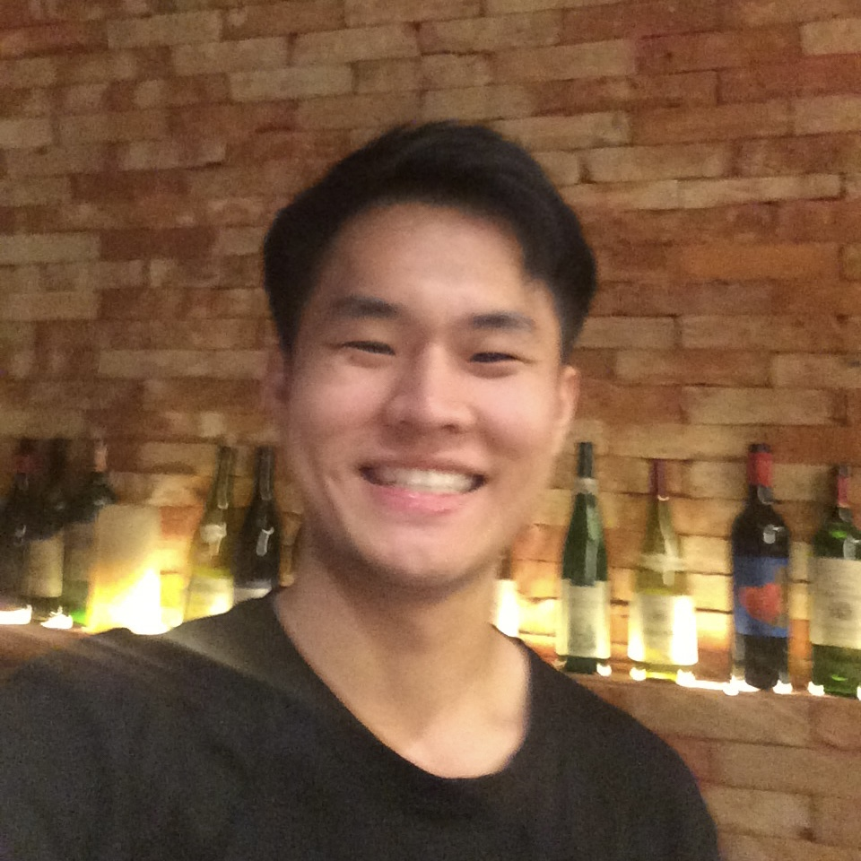

<nav class="custom-nav">
    

        <a href="#about" class="nav-link">👋 About Me</a>
        <a href="#news" class="nav-link">🔥 News</a>
        <a href="#publications" class="nav-link">📝 Publications & Preprints</a>
      <a href="#techreport" class="nav-link">📁 Tech Reports & Projects</a>
        <a href="#education" class="nav-link">🎓 Education</a>
        <a href="#experience" class="nav-link">💻 Experience</a>
        <a href="#honors" class="nav-link">🏆 Honors</a>
    

</nav>

    <aside class="custom-sidebar">
        

              
        

        <h1 class="name-title">Junyao Yang (杨竣尧)</h1>
        
        
AI Graduate Student

        
National University of Singapore Shanghai AI Lab

        

            <a href="mailto:junyaoyang@u.nus.edu" class="s-icon" title="Email"><svg viewBox="0 0 24 24"><path d="M20 4H4c-1.1 0-1.99.9-1.99 2L2 18c0 1.1.9 2 2 2h16c1.1 0 2-.9 2-2V6c0-1.1-.9-2-2-2zm0 4l-8 5-8-5V6l8 5 8-5v2z"/></svg></a>
            <a href="https://scholar.google.com/citations?hl=en&user=oY6uhJQAAAAJ&view_op=list_works&gmla=ALUCkoUMJix6T2_HpNHTL2p0tzdO_cjIn2_g4yK4169HrMlRbB-6PBgqJdjKVdGzpgXbn_3VnFGz80T7gHxAhts9XVq_C6FFhRN_6UcK5C8lpfBpi4oVz3q6s-41w6FwOLc_YJSkE7SWFP8" class="s-icon" title="Google Scholar"><svg viewBox="0 0 24 24"><path d="M12 24a7 7 0 1 1 0-14 7 7 0 0 1 0 14zm0-24L0 9.5l4.838 3.94A8 8 0 0 1 12 9a8 8 0 0 1 7.162 4.44L24 9.5z"/></svg></a>
            <a href="https://github.com/jyyang26" class="s-icon" title="Github"><svg viewBox="0 0 24 24"><path d="M12 0c-6.626 0-12 5.373-12 12 0 5.302 3.438 9.8 8.207 11.387.599.111.793-.261.793-.577v-2.234c-3.338.726-4.033-1.416-4.033-1.416-.546-1.387-1.333-1.756-1.333-1.756-1.089-.745.083-.729.083-.729 1.205.084 1.839 1.237 1.839 1.237 1.07 1.834 2.807 1.304 3.492.997.107-.775.418-1.305.762-1.604-2.665-.305-5.467-1.334-5.467-5.931 0-1.311.469-2.381 1.236-3.221-.124-.303-.535-1.524.117-3.176 0 0 1.008-.322 3.301 1.23.957-.266 1.983-.399 3.003-.404 1.02.005 2.047.138 3.006.404 2.291-1.552 3.297-1.23 3.297-1.23.653 1.653.242 2.874.118 3.176.77.84 1.235 1.911 1.235 3.221 0 4.609-2.807 5.624-5.479 5.921.43.372.823 1.102.823 2.222v3.293c0 .319.192.694.801.576 4.765-1.589 8.199-6.086 8.199-11.386 0-6.627-5.373-12-12-12z"/></svg></a>
            <a href="https://drive.google.com/file/d/17UEE4NB9HbyNba8TwQ5oO3y3Tu7hwhZm/view?usp=sharing" class="s-icon" title="Curriculum Vitae">
                <svg viewBox="0 0 24 24"><path d="M14 2H6c-1.1 0-1.99.9-1.99 2L4 20c0 1.1.89 2 1.99 2H18c1.1 0 2-.9 2-2V8l-6-6zm2 16H8v-2h8v2zm0-4H8v-2h8v2zm-3-5V3.5L18.5 9H13z"/></svg>
            </a>
            <a href="https://www.linkedin.com/in/junyao-yang-371282301/" class="s-icon" title="LinkedIn"><svg viewBox="0 0 24 24"><path d="M19 3a2 2 0 0 1 2 2v14a2 2 0 0 1-2 2H5a2 2 0 0 1-2-2V5a2 2 0 0 1 2-2h14m-.5 15.5v-5.3a3.26 3.26 0 0 0-3.26-3.26c-.85 0-1.84.52-2.32 1.3v-1.11h-2.79v8.37h2.79v-4.93c0-.77.62-1.4 1.39-1.4a1.4 1.4 0 0 1 1.4 1.4v4.93h2.79M6.88 8.56a1.68 1.68 0 0 0 1.68-1.68c0-.93-.75-1.69-1.68-1.69a1.69 1.69 0 0 0-1.69 1.69c0 .93.76 1.68 1.69 1.68m1.39 9.94v-8.37H5.5v8.37h2.77z"/></svg></a>
        

    </aside>

    <main class="custom-content">

        <section id="about" class="content-box">
            

                👋
                <h2 class="box-title">About Me</h2>
            

            

                🤠 Hi there, this is Junyao Yang. I am a graduate student at the School of Computing, National University of Singapore (NUS), where I am pursuing a specialization in Artificial Intelligence. My research interests lie in <strong>Natural Language Processing</strong>, <strong>Explainable Artificial Intelligence</strong> and <strong>Trustworthy Machine Learning</strong>.
                  
                🧐 My research story revolves around <strong>the Underlying Principles and Understanding of Artificial Intelligence</strong>, particularly focusing on how to enhance the <strong>"Robustness"</strong> and <strong>"Safety"</strong> of LLM-generated information and understand the <strong>Interpretability</strong> of model mechanisms, which connects to related areas such as <strong>Trustworthy LLM</strong> [<strong><a href="https://arxiv.org/abs/2406.01394">ACL 2025 Main</a></strong>, <strong><a href="https://arxiv.org/abs/2502.18517">EMNLP 2025 Main</a></strong>] and <strong>Agent</strong> [<strong><a href="https://arxiv.org/abs/2601.15075">Agentic Attribution</a></strong>, <strong><a href="https://arxiv.org/abs/2601.15075">AgentDoG</a></strong>], <strong>Reasoning Model Merging</strong> [<strong><a href="https://arxiv.org/abs/2508.03140">AAAI 2026</a></strong>, <strong><a href="https://arxiv.org/abs/2601.18491">ReasonAny</a></strong>] and <strong>Malicious Attacks</strong> [<strong><a href="https://arxiv.org/abs/2406.01394">ACL 2025 Main</a></strong>].
             
            

        </section>

        <section id="news" class="content-box">
             

                🔥
                <h2 class="box-title">News</h2>
            

            <ul class="news-list">
            <li>2026.01 🚀 Please check our latest tech report: <strong><a href="https://arxiv.org/abs/2601.18491">AgentDoG</a></strong>! It introduces a state-of-the-art diagnostic guardrail framework utilizing a three-dimensional taxonomy, featuring an Agentic XAI attribution module I contributed to for diagnosing the internal drivers of risky actions.</li>
            <li>2026.01 🚀 Please check our latest paper: <strong><a href="https://arxiv.org/pdf/2601.15075">Agentic Attribution</a></strong>! A hierarchical framework utilize temporal likelihood and perturbation-based analysis to unveil internal factors driving LLM-based agent actions.</li>
                <li>2026.01 🏄‍♂️ I will attend <strong>AAAI 2026 at Singapore during Jan 20-27, 2026</strong>. Let’s have fun!</li>
                <li>2026.01 🚀 Please check our latest paper: <strong><a href="https://arxiv.org/abs/2601.05560">ReasonAny</a></strong>! ReasonAny employs contrastive gradient identification to resolve destructive performance collapse, effectively merging reasoning capabilities into domain-specific models!</li>
                <li>2025.11 🎉 First-Author paper <a href="https://arxiv.org/abs/2508.03140">RCP-Merging</a> has been accepted to <strong>AAAI 2026 Main Track</strong>! See you in Singapore!</li>
                <li>2025.08 🎉 <a href="https://arxiv.org/abs/2502.18517">RewardDS</a> has been accepted to <strong>EMNLP 2025 Main</strong>!</li>
                <li>2025.08 🥳 I joined <a href="https://ai45.shlab.org.cn/">Shanghai AI Lab</a> as a Research Intern, advised by <a href="https://shenqildr.github.io/">Dongrui Liu</a>.</li>
                <li>2025.08 🚀 Check out my latest work: <a href="https://arxiv.org/abs/2508.03140">RCP-Merging</a>! This novel framework integrates long CoT capability into domain-specific LLMs without sacrificing their performance in the original domain!</li>
                <li>2025.05 🎉 Successfully passed my undergraduate thesis defense!</li>
                <li>2025.05 🎉 <strong>Co-First-Author paper</strong> <a href="https://arxiv.org/abs/2406.01394">PrivacyRestore</a> has been accepted to <strong>ACL 2025 Main</strong>! Deeply grateful to my mentor Ziqian and collaborator Jianwei! See you in Vienna!</li>
                <li>2025.02 🚀 Please check our newest papers: <strong><a href="https://arxiv.org/abs/2502.18517">RewardDS</a></strong> and <strong><a href="https://arxiv.org/abs/2406.01394">PrivacyRestore</a></strong>! Thanks to the help of other collaborators.</li>
                <li>2024.07 🥳 I joined <a href="https://github.com/ZeroNLP">ZeroNLP</a> as a Research Assistant, advised by Prof. <a href="https://ziqianzeng.github.io/">Ziqian Zeng</a>.</li>
                <li>2024.07 🥳 I spent a wonderful time at Tencent as a machine learning intern!</li>
                <li>2024.07 🚀 <strong>Contextless CS</strong> is available now, which reaches <strong>20,000 DAU</strong>! Check my work <strong><a href="https://kf.qq.com/">here</a></strong>!</li>
                <li>2024.04 🥳 I joined Tencent as a machine learning intern.</li>
                <li>2024.03 🥳 I spent a wonderful time at ShenZhen Stock Exchange as a machine learning intern!</li>
            </ul>
        </section>

        <section id="publications" class="content-box">
            

                📝
                <h2 class="box-title">Publications & Preprints</h2>
            

            

                

                    
                

                

                    arXiv Preprint
                    <a href="https://arxiv.org/abs/2601.05560" class="paper-title">ReasonAny: Incorporating Reasoning Capability to Any Model via Simple and Effective Model Merging</a>
                    

                        <strong>Junyao Yang</strong>, Chen Qian, Dongrui Liu&dagger;, Wen Shen, Yong Liu&dagger;, Jing Shao&dagger;
                    

                    

                        <strong>TL;DR:</strong> Merging robust chain-of-thought capabilities into domain-specific models (Safety, Biomedicine) using Contrastive Gradient Identification.
                    

                    

                        <a href="https://arxiv.org/abs/2601.05560">Paper</a>
                        <a href="https://github.com/jyyang26/ReasonAny">Code</a>
                    

                

            

            

                

                    
                

                

                    arXiv Preprint
                    <a href="https://arxiv.org/pdf/2601.15075" class="paper-title">The Why Behind the Action: Unveiling Internal Drivers via Agentic Attribution</a>
                    

                        Chen Qian, Peng Wang, Dongrui Liu&dagger;, <strong>Junyao Yang</strong>, Dadi Guo, Ling Tang, Jilin Mei, Qihan Ren, Shuai Shao, Yong Liu, Jie Fu, Jing Shao, Xia Hu
                    

                    

                        <strong>TL;DR:</strong> A hierarchical framework for agentic attribution, using temporal likelihood and perturbation-based analysis to unveil internal factors driving LLM-based agent actions.
                    

                    

                        <a href="https://arxiv.org/pdf/2601.15075">Paper</a>
                        <a href="https://arxiv.org/pdf/2601.15075">Code</a>
                    

                

            

            

                

                    
                

                

                    AAAI 2026 Main Track
                    <a href="https://arxiv.org/abs/2508.03140" class="paper-title">RCP-Merging: Merging Long Chain-of-Thought Models with Domain-Specific Models by Considering Reasoning Capability as Prior</a>
                    

                        <strong>Junyao Yang</strong>, Jianwei Wang, Huiping Zhuang, Cen Chen, Ziqian Zeng*&dagger;
                    

                    

                        <strong>TL;DR:</strong> Enhancing domain performance while preserving chain-of-thought reasoning abilities by treating reasoning as a prior.
                    

                    

                        <a href="https://arxiv.org/abs/2508.03140">Paper</a>
                        <a href="https://github.com/ZeroNLP/RCP-Merging">Code</a>
                    

                

            

            

                

                    
                

                

                    ACL 2025 Main
                    <a href="https://arxiv.org/abs/2406.01394" class="paper-title">PrivacyRestore: Privacy-Preserving Inference in Large Language Models via Privacy Removal and Restoration</a>
                    

                        Ziqian Zeng*&dagger;, Jianwei Wang*, <strong>Junyao Yang*</strong>, Zhengdong Lu, Haoran Li, Huiping Zhuang, Cen Chen
                    

                    

                        <strong>TL;DR:</strong> Protecting privacy via activation steering using a protected meta-vector without retraining.
                    

                    

                        <a href="https://arxiv.org/abs/2406.01394">Paper</a>
                        <a href="https://github.com/ZeroNLP/PrivacyRestore">Code</a>
                    

                

            

            

                

                    
                

                

                    EMNLP 2025 Main
                    <a href="https://arxiv.org/abs/2502.18517" class="paper-title">RewardDS: Privacy-Preserving Fine-Tuning for Large Language Models via Reward Driven Data Synthesis</a>
                    

                         Jianwei Wang, Chengming Shi, <strong>Junyao Yang</strong>, Haoran Li, Qianli Ma, Huiping Zhuang, Cen Chen, Ziqian Zeng&dagger;
                    

                    

                        <strong>TL;DR:</strong> Using client-side reward models to filter synthetic data, mitigating noise while protecting privacy.
                    

                    

                         <a href="https://arxiv.org/abs/2502.18517">Paper</a>
                         <a href="https://github.com/wjw136/RewardDS">Code</a>
                    

                

            

        </section>

        <section id="techreport" class="content-box">
            

                📁
                <h2 class="box-title">Tech Reports & Projects</h2>
            

                
              

                  

                      
                  

                  

                      Tech Report
                      <a href="https://arxiv.org/abs/2601.18491" class="paper-title">AgentDoG: A Diagnostic Guardrail Framework for AI Agent Safety and Security</a>
                      

                          Shanghai Artificial Intelligence Laboratory (Contributor)
                      

                      

                          <strong>TL;DR:</strong> A state-of-the-art diagnostic guardrail framework utilizing a unified three-dimensional taxonomy to provide fine-grained monitoring and root-cause analysis of AI agent safety risks.
                      

                      

                          <a href="https://arxiv.org/abs/2601.18491">Paper</a>
                          <a href="https://github.com/AI45Lab/AgentDoG">Code</a>
                          <a href="https://huggingface.co/collections/AI45Research/agentdog">Model</a>
                          <a href="https://huggingface.co/papers/date/2026-01-28">#1 🤗 Daily Best Paper</a>
                          <a href="http://xhslink.com/o/5qySfXc7xCu">📕小红书</a>
                      

                  

              

              
            

        </section>
        
        <section id="education" class="content-box">
            

                🎓
                <h2 class="box-title">Education</h2>
            

            

                

                    
                    
M.S. in AI

                    
National University of Singapore

                    2025 - 2027 (Expected)
                

                

                    
                    
B.S. in CS (with honor)

                    
South China University of Technology

                    2021 - 2025
                

                

                    
                    
High School

                    
Shenzhen Experimental School

                    2018 - 2021
                

            

        </section>

        <section id="experience" class="content-box">
             

                💻
                <h2 class="box-title">Experience</h2>
            

             

                

                    
                    

                        
Shanghai AI Lab

                        
Research Intern | 2025.06 - Present

                    

                

                

                    
                    

                        
South China University of Technology

                        
Research Intern | 2024.07 - 2025.06

                    

                

                

                    
                    

                        
Tencent

                        
Machine Learning Intern | 2024.04 - 2024.07

                    

                

                

                    
                    

                        
SZSE

                        
Machine Learning Intern | 2024.01 - 2024.04

                    

                

            

        </section>
        
        <section id="honors" class="content-box">
            

                🏆
                <h2 class="box-title">Honor & Awards</h2>
            

            <ul style="font-size: 14px; line-height: 2; color: #4b5563; padding-left: 20px;">
                <li>Excellent Graduation Thesis (2025.06)</li>
                <li>Outstanding Student Leader (2022-2024)</li>
                <li>Second-Class Scholarship of SCUT (2024.10)</li>
                <li>Second-Class Award in CUMCM at Guangdong Province (2022.09)</li>
            </ul>
        </section>

        <section id="visitor-map" class="content-box">
            

                🌏
                <h2 class="box-title">Page Views</h2>
            

            

                 
            

        </section>

    </main>

